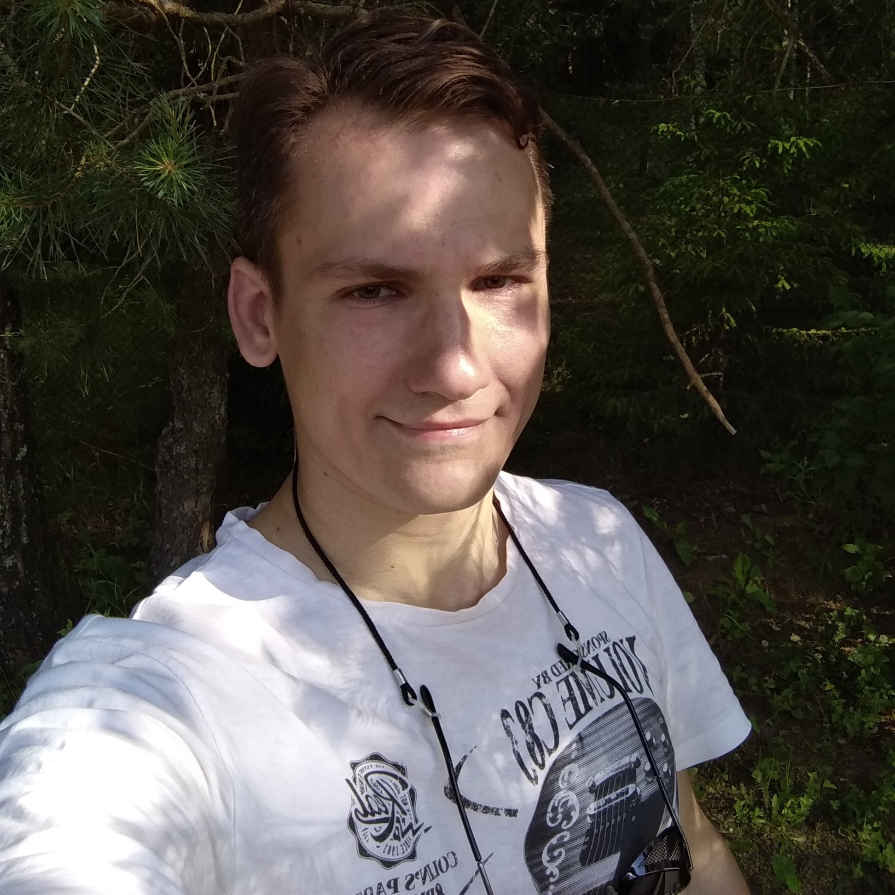

# **Dmitrij Didencko**


===


**Contacts:**

* Location: Minsk, Belarus
* Phone: +375 44 573-70-86
* E-mail: dmitrij.didencko@yandex.by
* Telegram:@warp5t
* GitHub:@warp5t
* Discord: warp5t#8930


**About me:**


_Finished his studies at the Faculty of Biology. Worked for 3 years in the laboratory of microbiological method.
At the moment I work merchandising of the confectionery factory “Spartac”. My level of English B1. My main direction of learning english is alive communication with people.
I’m interested in creating computer games and have little experience developing JS games using css and html. Also, I perform some task from previous stages RSS and you able to check if you interested.
My goal is to gain knowledge of the front-end developer and further employment in the received specialty._


**Skils:**


* HTML
* CSS
* JS
* C(little)
* GIT


**Code Example:**

*Count characters in your string*


```
function count (string) {
    let coincidense = {};
    let ammount = 0;
    for(let i = 0; string.length > i; i++) {
        ammount = 0;
       for(let j = 0; string.length > j; j++){
        if(string[i] == string[j]) {
            ammount ++;
            coincidense[`${string[i]}`] = ammount;
        }
       }
    }
     return coincidense;
  }

```
